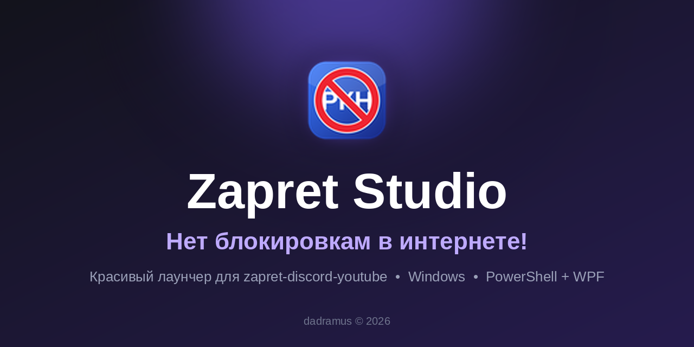
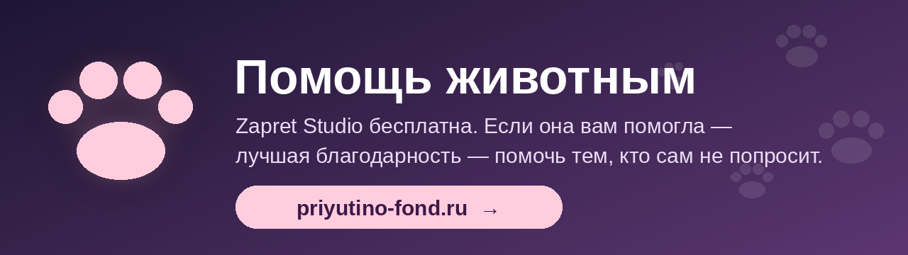

# 🛡️ Zapret Studio

**Красивая «пульт-управлялка» для zapret-discord-youtube.**
Нажал одну кнопку — и YouTube с Discord снова работают. Без чёрных окон, `.bat`-файлов на двадцать вариантов и танцев с бубном.

[⬇️ **Скачать**](../../releases/latest) · [📖 Установка](#-установка-за-3-минуты) · [🔒 Безопасность](#-а-это-не-вирус) · [❓ Вопросы](#-частые-вопросы) · [🐾 Помощь](#-помощь-автору) · [🇬🇧 English](#-english)

---

## 🤔 Что это

**Zapret Studio** — удобная графическая оболочка для набора стратегий [**zapret-discord-youtube**](https://github.com/Flowseal/zapret-discord-youtube) (на движке [zapret](https://github.com/bol-van/zapret)). Сам обход блокировок делает оригинальный zapret, а Zapret Studio превращает его в нормальную программу: красивое окно, карточки стратегий, подбор, слежение за связью и автопочинка.

> 🧩 Проще говоря: zapret — это двигатель, а Zapret Studio — приборная панель, руль и климат-контроль.

## 🎯 Зачем это нужно

С оригинальным набором приходится вручную перебирать десяток `general*.bat`, гадать, какой из них подходит именно твоему провайдеру, и перезапускать всё после каждого сбоя. Zapret Studio делает это за тебя:

| 😩 Было | 😎 Стало |
|---|---|
| Пробуешь `general`, `general (ALT)`, `ALT2`… ALT11 по очереди | Кнопка **«Подбор»** сама проверяет стратегии и предлагает лучшую |
| Не понятно, работает ли обход вообще | Значок в трее: зелёный — всё хорошо, красный — что-то сломалось, и причина написана словами |
| Обход упал — сидишь без YouTube | **Автовосстановление**: перезапуск и переход на следующую рабочую стратегию |
| Чёрное окно консоли висит на панели задач | Окно скрыто, окно PowerShell при запуске **не мигает** |
| Страшные названия файлов | Понятные имена, описания и подсказки при наведении |

## 👥 Для кого

- 🎮 Для тех, кому нужны **YouTube, Discord, Telegram, Twitch** и другие сервисы без лишней возни.
- 🧓 Для тех, кто «не программист» — вся настройка мышкой, есть вкладка **«Инструкция»**.
- 🧑‍💻 Для тех, кто любит порядок: всё открыто, один скрипт, читается глазами.
- 🧪 Для любителей подкрутить: темы, шрифты, прозрачность, режимы подбора.

## ✨ Возможности

- 🚀 **Запуск двойным щелчком** по карточке, звёздочка — «в избранное».
- 🎯 **Подбор под мои задачи**: отметь сервисы (YouTube, Discord, Telegram, Instagram, X, Twitch, Cloudflare или свой сайт) — программа проверит стратегии и выберет лучшую.
  - **Только нужная** — быстро, проверяет только выбранное.
  - **Полная проверка** — тщательно, по всем сервисам.
  - **Срочная проверка** — берёт первую стратегию со 100% и сразу оставляет её работать.
- 📡 **Слежение за связью**: раз в 1–5 минут проверяет твои сервисы; при сбое — красный значок, всплывающее уведомление и причина.
- 🔁 **«Не давать обходу обрываться»**: если `winws` закрылся (антивирус, сон, смена сети/VPN) — запускается заново, со сбросом WinDivert при необходимости.
- 🩹 **Автовосстановление**: стратегия не держится — переходим на следующую рабочую.
- 🎨 **Внешний вид**: акцентный цвет, стекло/размытие, закруглённые углы, свой шрифт и размер текста.
- 🖥️ **Трей, автозапуск с Windows, ярлык на рабочем столе** со значком перечёркнутого РКН.
- 🎬 **Красивая заставка** «Нет блокировкам в интернете!» при запуске.
- 📚 **Встроенная инструкция** и кнопка «О создателях».

## 📸 Скриншоты

<!-- Положи скриншоты в папку docs/ и раскомментируй:

  

-->
*Скоро здесь будут скриншоты. Пока что поверьте на слово — красиво.* 😎

## 📦 Установка за 3 минуты

> Нужно: **Windows 10/11**, Windows PowerShell 5.1 (уже есть в системе), права администратора.

1. **Скачайте оригинальный набор** [zapret-discord-youtube](https://github.com/Flowseal/zapret-discord-youtube/releases) и распакуйте в удобную папку (там должны лежать `general*.bat` и папка `bin`).
2. **Скачайте Zapret Studio** со страницы [Releases](../../releases/latest) (файл `ZapretStudio-vX.Y.Z-release.zip`).
3. Распакуйте архив **в ту же папку**, где лежат `general*.bat`. Должны оказаться рядом: `ZapretStudio.ps1`, `ZapretStudio.bat`, `ZapretStudio.vbs`, `ZapretStudio.ico`.
4. Запустите **`ZapretStudio.bat`** и подтвердите запрос администратора (он нужен драйверу WinDivert — без него обход не работает).
5. Дважды щёлкните карточку стратегии — или нажмите **«Подбор»**. Готово! 🎉

> 💡 Тип Windows-защиты «SmartScreen» может сказать «Неизвестный издатель» — программа у нас индивидуальная, без платной подписи. Подробнее — в разделе про безопасность.

## 🔒 А это не вирус?

Справедливый вопрос — программа просит права администратора и скрыто запускает PowerShell. Поэтому честно и по пунктам:

- ✅ **Автор заверяет:** в Zapret Studio **нет вирусов, майнеров, шпионов и рекламы.**
- ✅ **Весь код открыт.** Это обычный текстовый скрипт `ZapretStudio.ps1` — откройте его в Блокноте и прочитайте. Ничего не зашифровано и не спрятано (кроме значка, он закодирован в base64 как картинка).
- ✅ **Нет телеметрии.** Программа ничего не отправляет автору и никуда не звонит. Единственные сетевые запросы — проверка доступности сайтов, которые **вы** выбрали, и контрольный адрес Microsoft (`msftconnecttest.com`) для проверки интернета.
- ✅ **Ничего не скачивает и не выполняет из интернета** (нет `Invoke-WebRequest`, `iex` и подобного).
- ✅ **Права администратора** нужны только драйверу WinDivert (его использует zapret). Программа создаёт задачу автозапуска *только если вы сами включили* этот переключатель.
- 🔎 **Проверьте сами:** загрузите архив на [VirusTotal](https://www.virustotal.com/). Контрольная сумма SHA-256 каждого релиза указана на его странице — сверьте.

> ⚠️ **Про антивирусы.** Способ запуска (скрытый PowerShell + запрос прав) выглядит для некоторых антивирусов подозрительно, как и сам zapret с драйвером WinDivert. Возможны **ложные срабатывания**. Если ваш антивирус ругается — сверьте хеш, прочитайте код и решайте сами; добавлять в исключения или нет — ваше дело.

## 🙏 Важно: что здесь чьё

> **Сам zapret мне не принадлежит.** Я не автор ни движка, ни стратегий, ни драйвера и не претендую на них.

| Компонент | Автор | Что это |
|---|---|---|
| [**zapret-discord-youtube**](https://github.com/Flowseal/zapret-discord-youtube) | Flowseal и участники | Набор готовых стратегий и `.bat`-файлов — **оригинал, который нужен для работы** |
| [**zapret** (`winws`)](https://github.com/bol-van/zapret) | bol-van | Движок обхода DPI |
| [**WinDivert**](https://github.com/basil00/WinDivert) | basil00 | Драйвер перехвата пакетов |

Zapret Studio **не содержит** этих компонентов в репозитории и **не изменяет** их — только запускает ваш `general*.bat` и проверяет результат. Все права на них принадлежат их авторам и распространяются по их лицензиям. Большое спасибо им за их труд! 💜

Названия YouTube, Discord, Telegram, Instagram, X, Twitch, Cloudflare принадлежат их владельцам и используются лишь для проверки доступности. Проект с ними никак не связан.

**Моё здесь:** оболочка Zapret Studio — интерфейс, подбор, слежение, автовосстановление, заставка, инструкции и значок.

## ❓ Частые вопросы

<b>Это взлом интернета? Меня посадят?</b> 🕵️

Нет, это не «взлом». Программа не меняет сайты и не обходит ничего, кроме фильтрации у вашего провайдера, — то же самое делает оригинальный zapret. За соблюдение законов вашей страны отвечаете вы сами.

<b>Windows пишет «Неизвестный издатель» / антивирус ругается</b> 🚨

У проекта нет платной цифровой подписи, а запрос прав администратора и скрытый запуск выглядят для антивирусов подозрительно. Сверьте SHA-256 с релизом, проверьте на VirusTotal, прочитайте код — он открыт.

<b>Ничего не запускается / «winws не запустился»</b> 🔧

Проверьте: 1) запуск от имени администратора; 2) рядом лежат `general*.bat` и папка `bin`; 3) антивирус не блокирует папку; 4) не включён другой VPN/обход, конфликтующий с WinDivert. Подробности — на вкладке «Инструкция».

<b>Какую стратегию выбрать?</b> 🎲

Нажмите «Подбор». Если лень ждать — режим «Срочная проверка». Звёздочкой отметьте любимую, и она будет проверяться первой.

<b>Можно ли без Studio, просто zapret?</b> 🤷

Конечно! Zapret Studio — это удобство, а не обязательное условие. Оригинал живёт [здесь](https://github.com/Flowseal/zapret-discord-youtube).

<b>Как удалить?</b> 🧹

Выключите автозапуск в настройках, нажмите «Выход» и удалите файлы Zapret Studio. Файл настроек — `zapret-studio.json` рядом с программой.

## 🐛 Нашли ошибку или есть идея?

Открывайте [Issue](../../issues): опишите, что произошло, версию Windows и что показывает журнал в окне программы. Только **не прикладывайте личные данные**. Баги кушают кофе, но мы их ловим. ☕

## 🐾 Помощь автору

Я делаю программы только для сограждан из России и стран СНГ — для тех, кому это действительно нужно. Zapret Studio бесплатна, и денег за неё я не прошу.

Если программа вам помогла и хочется сказать «спасибо» — донатить мне не нужно. Лучше помогите тем, кто сам попросить не может: переведите любую сумму в **фонд помощи животным**. Даже маленькая сумма имеет значение. А если денег нет — поставьте ⭐ репозиторию и расскажите о программе другу. Этого тоже достаточно. 🐶🐱

  

## 📜 Лицензия

Это **не open-source**: © 2026 **dadramus**, все права защищены. Разрешено бесплатное личное использование и передача неизменённой копии с сохранением авторства. Продажа, удаление авторства и распространение изменённых версий под именем Zapret Studio — только с письменного согласия автора. Полные условия — в [LICENSE.txt](LICENSE.txt). Просмотр и форк репозитория на GitHub — в рамках Условий использования GitHub.

Программа предоставляется «как есть», без гарантий.

## 🇬🇧 English

**Zapret Studio** is a pretty Windows launcher (PowerShell + WPF) for [zapret-discord-youtube](https://github.com/Flowseal/zapret-discord-youtube): one-click strategy launch, automatic strategy finder, connection monitoring, auto-recovery, tray icon, themes.

- **Not affiliated with / does not include** zapret, zapret-discord-youtube or WinDivert — download them from their original authors: [Flowseal/zapret-discord-youtube](https://github.com/Flowseal/zapret-discord-youtube), [bol-van/zapret](https://github.com/bol-van/zapret), [basil00/WinDivert](https://github.com/basil00/WinDivert).
- **No telemetry, no downloads, plain-text source.** Administrator rights are needed only for the WinDivert driver.
- **Install:** unpack the release next to your `general*.bat` files and run `ZapretStudio.bat`.
- **License:** © 2026 dadramus, all rights reserved; free personal use and redistribution of unmodified copies allowed. See [LICENSE.txt](LICENSE.txt).

---

Сделано с ❤️ **dadramus** · помощь в создании — **KolRau**

*Если программа помогла — поставьте ⭐ репозиторию. Это бесплатно и греет душу.*

